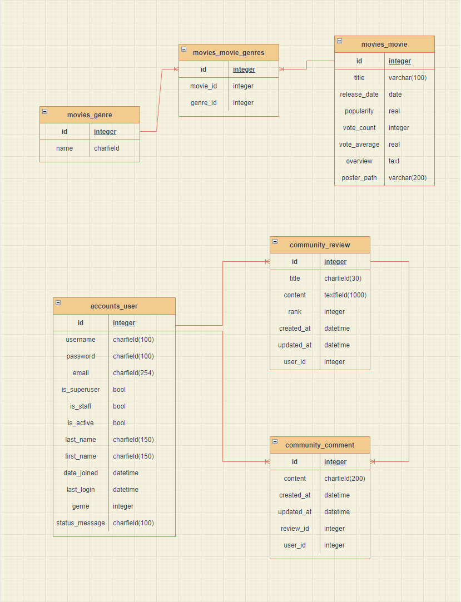
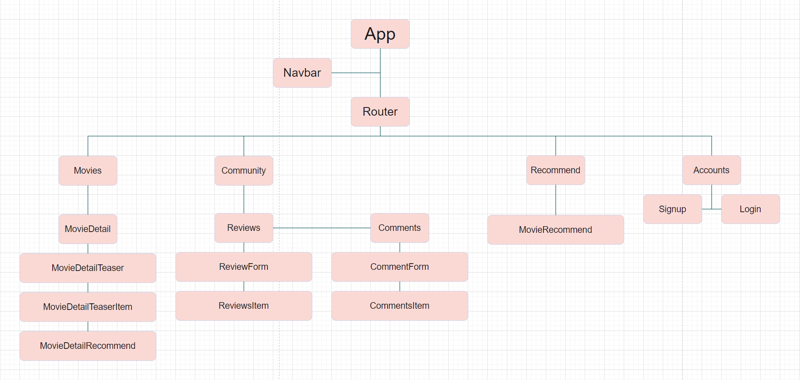
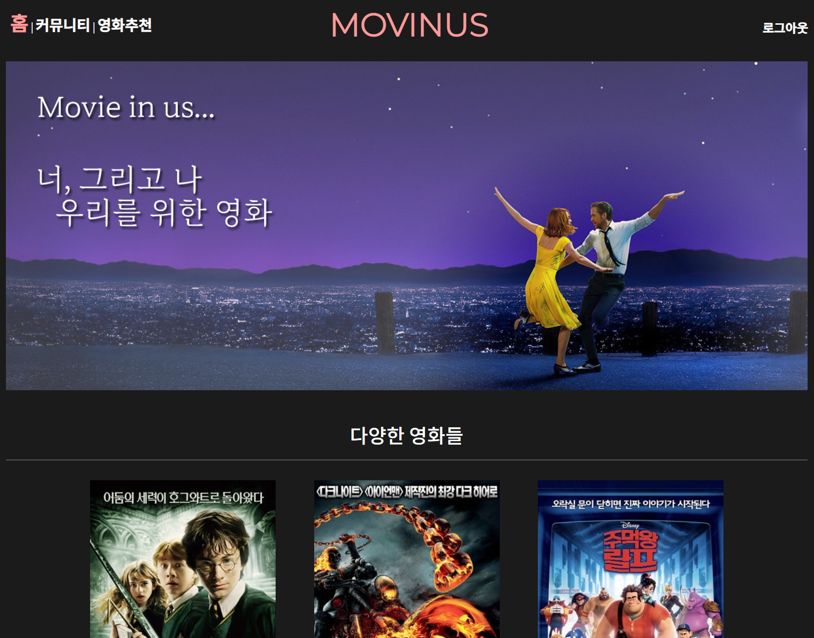
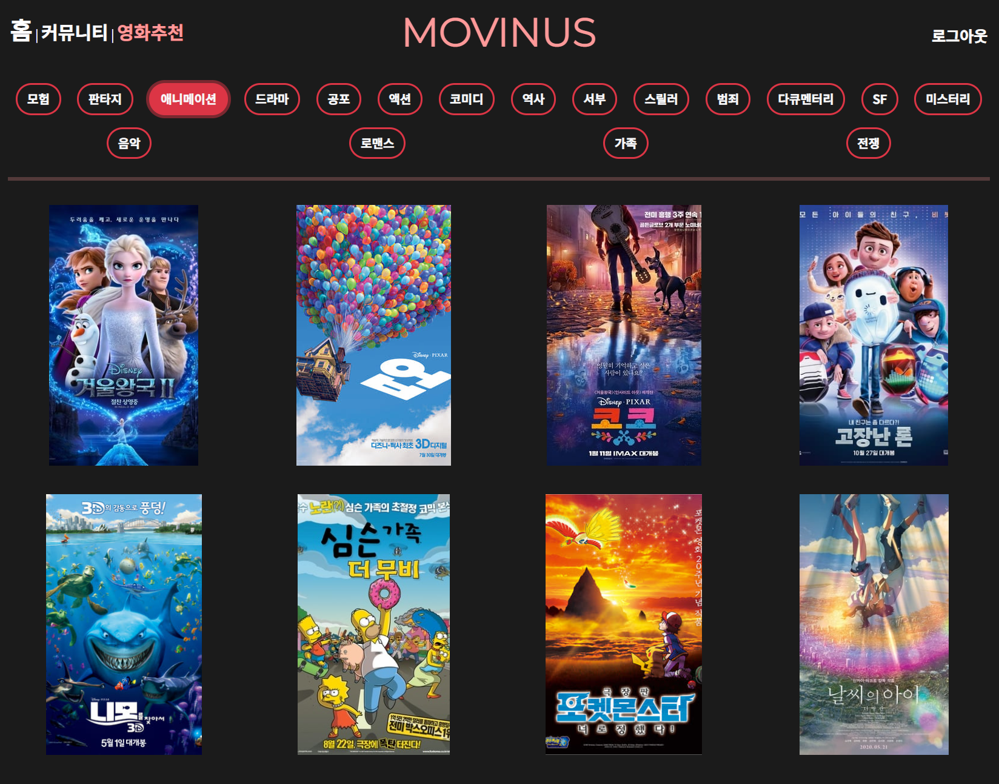
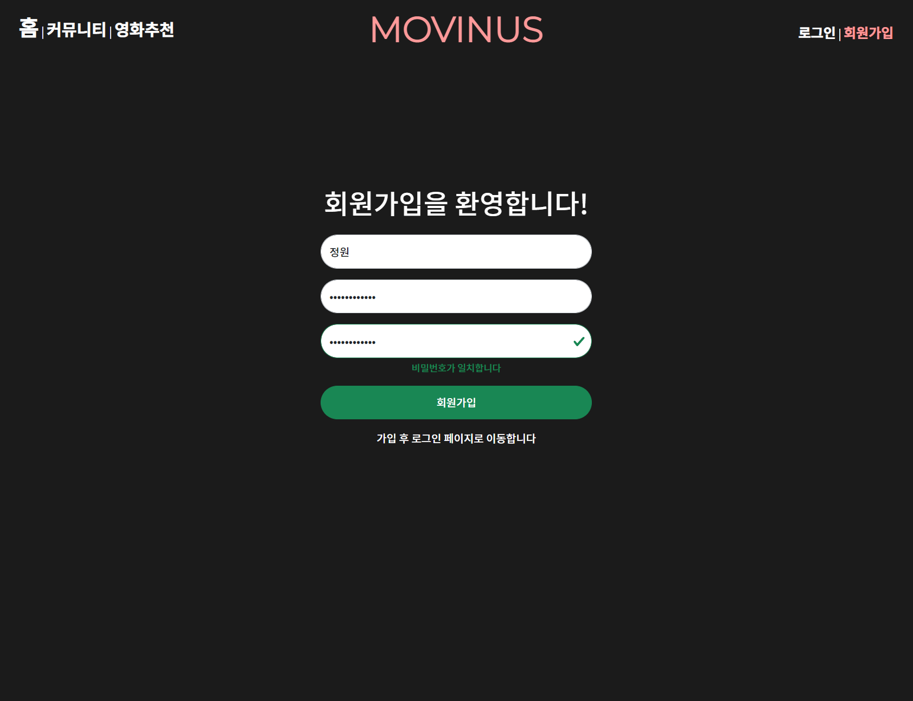
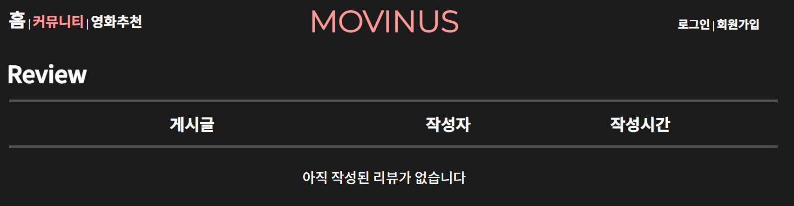

# PROJECT - MOVINUS

## 목차

	1. 팀원 정보 및 업무 분담 내역
	2. 목표 서비스 구현 및 실제 구현 정도
	3. 데이터베이스 모델링(ERD)
	4. 기능에 대한 설명
	5. 기타(느낀점)
	6. 실행화면

### 팀원 정보 및 업무 분담 내역

#### 	Back-End : 정윤정, Front-End : 이정원

#### 	

### 목표 서비스 구현 및 실제 구현 정도

#### 	목표 서비스

- 여러가지 영화 정보를 얻을 수 있습니다.
- 커뮤니티 기능을 통해 영화에 대해 유저들 간 소통이 가능합니다.
- 유저는 영화에 "좋아요"를 표시할 수 있습니다. 

#### 	실제 구현

- 여러가지 영화 정보를 얻을 수 있도록 구현하였습니다.
- 커뮤니티에서 영화에 대해 유저들 간에 리뷰를 작성할 수 있습니다.
- 댓글 작성을 통해 소통이 가능하게 구현하였습니다.
- 유저는 장르를 바탕으로 영화를 추천 받을 수 있습니다.

### 모델링(ERD)

#### 	DB

#### 	Vue

### 기능에 대한 설명

- 메인
  - DB에 들어있는 영화 전체를 랜덤하게 보여줍니다
  - 영화 클릭 시 해당 영화의 상세페이지로 이동합니다
  - 상단 nav에 로그인 되어있을 시 "로그아웃"을, 아닐 시 "로그인"과 "회원가입"을 표시합니다
- 상세 페이지
  - 영화의 제목 평점 줄거리를 보여줍니다
  - YoutubeAPI를 활용하여 해당 영화의 예고편을 받아옵니다
    - 예고편이 없을경우 동작하지 않을 수 있습니다
  - 영화의 장르를 보여줍니다
  - 장르를 클릭하면 해당 장르의 다른 영화들을 보여줍니다
    - 상세 페이지로 처음 이동할 때 받아오는 장르추천영화들은 해당 영화의 장르중 첫번째 장르입니다
    - 장르로 추천받은 영화를 클릭하면 추천받은 영화의 상세 페이지로 이동합니다
- 커뮤니티
  - 리뷰 및 댓글을 생성, 수정, 삭제 할 수 있습니다
    - 본인이 작성한 리뷰, 댓글만 수정, 삭제할 수 있습니다
  - 리뷰 제목 클릭시 리뷰 상세페이지를 보여줍니다
    - 리뷰 상세페이지는 리뷰 제목, 작성자, 평점, 내용, 댓글을 보여줍니다
- 영화추천
  - 영화를 분류하는 전체 장르를 보여줍니다
  - 장르를 클릭하면 해당 장르의 영화 8개를 보여줍니다
    - 해당 장르의 영화가 8개 미만일 경우, 8개가 표시되지 않을 수 있습니다
  - 추천된 영화를 클릭하면 해당 영화의 상세 페이지로 이동합니다
- 계정
  - 회원가입
    - 비밀번호와 비밀번호확인이 일치하는지 확인합니다
    - 회원가입 후 로그인 페이지로 이동합니다
  - 로그인
    - 로그인 후 메인페이지로 이동합니다
    - 회원이 아닐경우 회원가입을 할 수 있도록 안내합니다

### 기타(느낀점)

- URL배포는 하지 않았습니다.
- 윤정:
  - 일주일이라는 시간이 주어졌을 때 시간이 충분할 것이라고 생각했지만, 실제로 프로젝트를 진행해보니 생각과는 많이 달랐습니다. 튼튼하게 짰다고 생각했던 기획도 프로젝트 진행중에 바뀌기도 하고, 갑작스럽게 몸 컨디션이 안좋기도 하는 등 여러가지 변수에 의해서 프로젝트 진행에 영향을 줄 수 있다는 것을 느꼈습니다. 
  - 이번 프로젝트에서 백엔드를 맡으면서 배운것을 실제로 적용하는 것이 쉽지 않다는 것을 느꼈습니다. 하지만 실제로 적용하기 위해 여러가지 자료들을 찾아보고 직접 이것 저것 해보면서 배운내용을 더 확실히 이해하게 되었습니다.
- 정원:
  - 

### 실행화면

