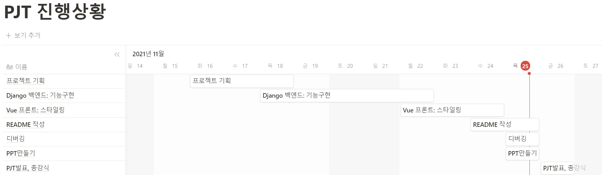
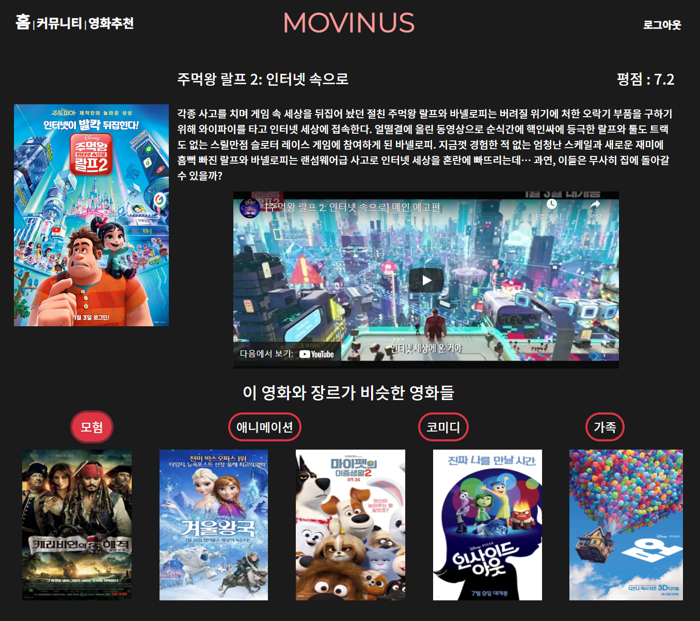
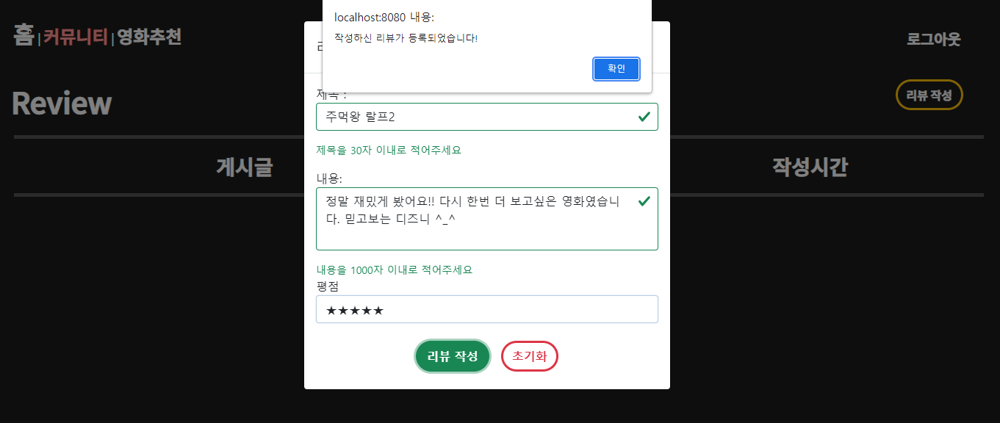
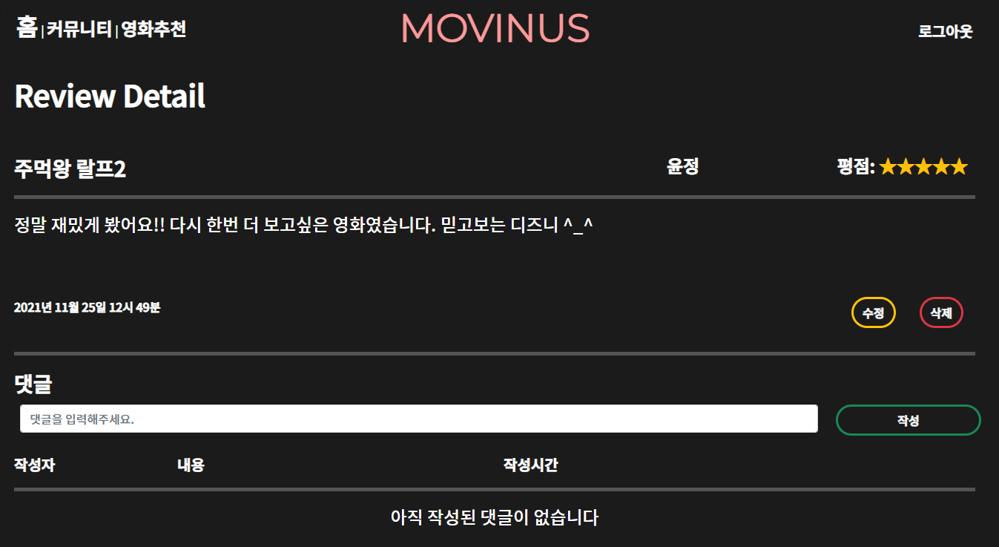

# PROJECT - MOVINUS

## 목차

1. 팀원 정보 및 업무 분담 내역
2. 코드 실행
3. 목표 서비스 구현 및 실제 구현 정도
4. 데이터베이스 모델링(ERD)
5. 기능에 대한 설명
6. 기타(느낀점)
6. 실행화면


### 팀원 정보 및 업무 분담 내역

#### 	Back-End : 정윤정, Front-End : 이정원

#### 	

### 코드 실행

#### .../final-pjt/final-pjt-front/ 

#### 위 경로에 .env.local 파일을 생성해주세요

```bash
Back-End


cd final-pjt-back

python -m venv venv

source venv/Scripts/activate

python manage.py migrate

python manage.py loaddata movies.json

python manage.py runserver
```

```bash
Front-End


cd final-pjt-front

npm i

npm run serve
```

```.env.local
VUE_APP_YOUTUBE_API_KEY='발급 받은 API키를 '' 없이 KEY값만 입력해주세요'
```


### 목표 서비스 구현 및 실제 구현 정도

#### 	목표 서비스

- 여러가지 영화 정보를 얻을 수 있습니다.
- 커뮤니티 기능을 통해 영화에 대해 유저들 간 소통이 가능합니다.
- 유저는 영화에 "좋아요"를 표시할 수 있습니다. 

#### 	실제 구현

- 여러가지 영화 정보를 얻을 수 있도록 구현하였습니다.
- 커뮤니티에서 영화에 대해 유저들 간에 리뷰를 작성할 수 있습니다.
- 댓글 작성을 통해 소통이 가능하게 구현하였습니다.
- 유저는 장르를 바탕으로 영화를 추천 받을 수 있습니다.


### 기획, 회의록, 로드맵, 타임라인, 일지 (팀 Notion)

https://dented-mango-660.notion.site/dd755b27b3564da5b72da98d8022f062?v=8862febce01a49158391d51108aed6df




### 모델링(ERD)

#### 	DB


#### 	Vue


### 기능에 대한 설명

- 메인
  - DB에 들어있는 영화 전체를 랜덤하게 보여줍니다
  - 영화 클릭 시 해당 영화의 상세페이지로 이동합니다
  - 상단 nav에 로그인 되어있을 시 "로그아웃"을, 아닐 시 "로그인"과 "회원가입"을 표시합니다
- 상세 페이지
  - 영화의 제목 평점 줄거리를 보여줍니다
  - YoutubeAPI를 활용하여 해당 영화의 예고편을 받아옵니다
    - 예고편이 없을경우 동작하지 않을 수 있습니다
  - 영화의 장르를 보여줍니다
  - 장르를 클릭하면 해당 장르의 다른 영화들을 보여줍니다
    - 상세 페이지로 처음 이동할 때 받아오는 장르추천영화들은 해당 영화의 장르중 첫번째 장르입니다
    - 장르로 추천받은 영화를 클릭하면 추천받은 영화의 상세 페이지로 이동합니다
- 커뮤니티
  - 리뷰 및 댓글을 생성, 수정, 삭제 할 수 있습니다
    - 본인이 작성한 리뷰, 댓글만 수정, 삭제할 수 있습니다
  - 리뷰 제목 클릭시 리뷰 상세페이지를 보여줍니다
    - 리뷰 상세페이지는 리뷰 제목, 작성자, 평점, 내용, 댓글을 보여줍니다
- 영화추천
  - 영화를 분류하는 전체 장르를 보여줍니다
  - 장르를 클릭하면 해당 장르의 영화 8개를 보여줍니다
    - 해당 장르의 영화가 8개 미만일 경우, 8개가 표시되지 않을 수 있습니다
  - 추천된 영화를 클릭하면 해당 영화의 상세 페이지로 이동합니다
- 계정
  - 회원가입
    - 비밀번호와 비밀번호확인이 일치하는지 확인합니다
    - 회원가입 후 로그인 페이지로 이동합니다
  - 로그인
    - 로그인 후 메인페이지로 이동합니다
    - 회원이 아닐경우 회원가입을 할 수 있도록 안내합니다


### 기타(느낀점)

- URL배포는 하지 않았습니다.
- 윤정:
  - 일주일이라는 시간이 주어졌을 때 시간이 충분할 것이라고 생각했지만, 실제로 프로젝트를 진행해보니 생각과는 많이 달랐습니다. 튼튼하게 짰다고 생각했던 기획도 프로젝트 진행중에 바뀌기도 하고, 갑작스럽게 몸 컨디션이 안좋기도 하는 등 여러가지 변수에 의해서 프로젝트 진행에 영향을 줄 수 있다는 것을 느꼈습니다. 하지만 그럼에도 프로젝트를 진행함에는 **기획부터 튼튼하게**! 는 진리입니다.
  - 이번 프로젝트에서 백엔드를 맡으면서 배운것을 실제로 적용하는 것이 쉽지 않다는 것을 느꼈습니다. 하지만 실제로 적용하기 위해 여러가지 자료들을 찾아보고 직접 이것 저것 해보면서 배운내용을 더 확실히 이해하게 되었습니다. 그 중에서 serializer에 대해서는 더 공부가 필요하다고 생각합니다. 이해를 잘 하였다면 훨씬 더 좋은 결과물이 나올 수 있었을 것이라 아쉬움이 남습니다.
  - 수업을 들으면서도 백엔드, 프론트엔드 어떻게 연결이 되는 것이고 어떤 차이가 있는지 명확히 몰랐었지만 프로젝트를 진행하면서 어느정도 개념을 잡게되었습니다. 어느 파트가 더 중요하다 할 것 없이 두 파트는 **모두 중요**했습니다. 백엔드와 프론트엔드에서 여러가지 기능을 구현해 볼 때, 다른 웹사이트에서 이미 구현되어있는 기능을 직접 구현하는 것이 이렇게 힘든 일인지 처음 알았습니다. 네이버나 구글 같은 사이트가 하늘에서 뚝! 떨어지는게 아니라는 것을 뼈져리게.. 느꼈습니다. 웹개발자님들 존경합니다! 😂
- 정원:
  - **프론트 정말 재밌습니다, 프론트 최곱니다, 코딩하느라 밥생각도 안납니다.** 전제조건이 하나 있다면, 윤정누나처럼 실력좋은 백엔드와 함께해야 한다는 생각이 들었습니다. 하지만 모든 프로젝트가 이번처럼 팀운이 좋을 수는 없으니, 기본적인 백엔드를 다시 공부하려 합니다
  - 건강 얘기를 빼놓을 수가 없는데, 이번 PJT하면서 과로도 경험해봤고 기획이 틀어지는 등 영향을 끼쳤기 때문에 생각을 많이 해보는 기회가 되었습니다. **"실력+체력+시간 > 명세"** 의 값이 참이어야 결과물을 낼 수 있다는 것을 실전 경험을 통해 배웠습니다. 
  - **깔끔한 코드**를 쓰기 위한 노력을 더 많이 해야 할 것 같습니다. Vue같은 경우 컴포넌트 단위로 쪼개서 관리하기 쉽도록 하기위함이 있는데, 당장 개발하기 편하자고 Vue를 활용하지 못한 채, 코드를 너무 휘갈긴 것 같습니다. 스타일링도 불필요한 내용이 많았고 가독성도 많이 안좋은 것 같습니다. 결국 어제 짠 코드를 오늘은 이해하지 못하는 일도 꽤 있었습니다. 첫 실전경험으로 보자면 매우 만족스러운 결과물이지만, 이후 작성해나갈 코드들도 생각하면서, 여러 개선점들을 스스로 피드백해볼 수 있었습니다.


### 실행화면







